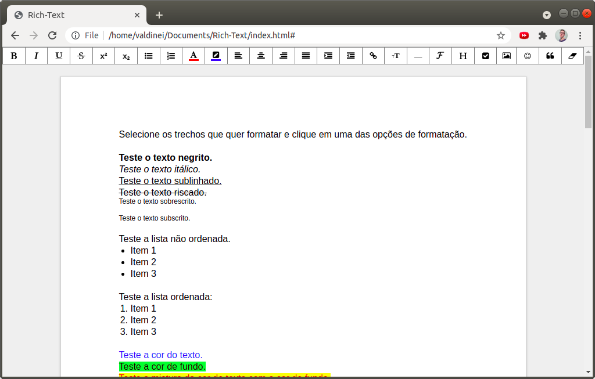
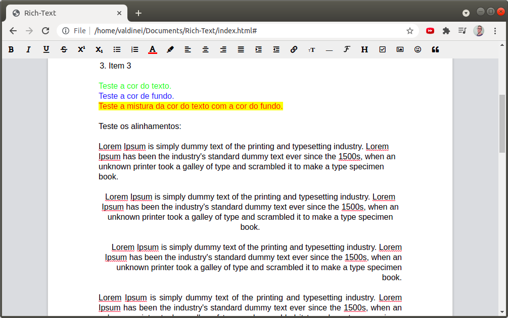
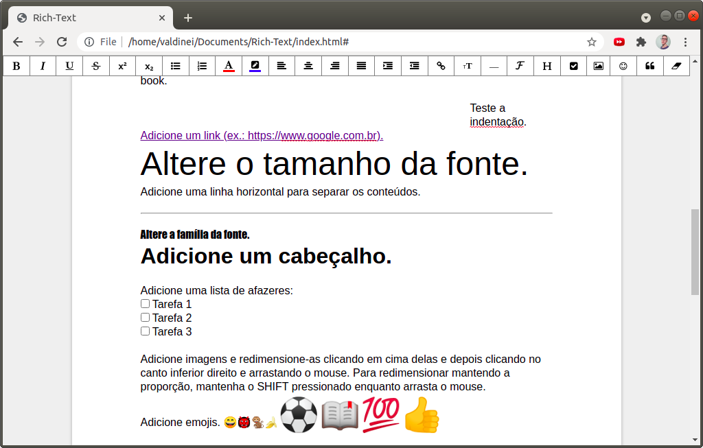
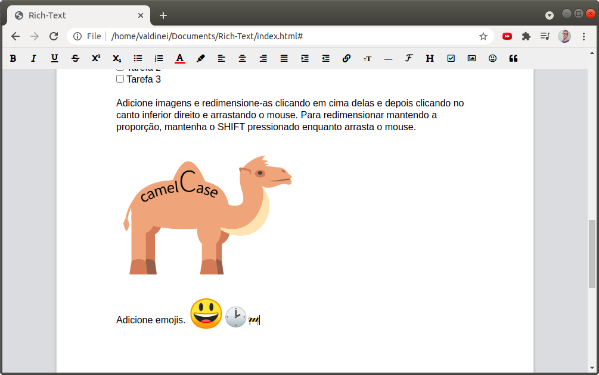

# Rich-Text
Um editor de texto com formatação Rich-Text. 
# Funcionalidades
- [x] Negrito.
- [x] Itálico.
- [x] Sublinhado.
- [x] Riscado.
- [x] Sobrescrito.
- [x] Subscrito.
- [x] Lista não ordenada.
- [x] Lista ordenada.
- [x] Cor do texto.
- [x] Cor de fundo.
- [x] Link.
- [x] Alinhamento à esquerda.
- [x] Alinhamento ao centro.
- [x] Alinhamento à direita.
- [x] Alinhamento justificado.
- [x] Adição de recuo.
- [x] Remoção de recuo.
- [x] Tamanho do texto.
- [x] Linha horizontal.
- [x] Família da fonte.
- [x] Cabeçalhos.
- [x] Checklist.
- [x] Adicionar imagem.
- [x] Redimensionar imagem/GIF.
- [x] Emoji.
- [x] Citação.
- [ ] Adicionar vídeo.
- [ ] Áudio.
- [ ] Adicionar um atalho do teclado para cada funcionalidade.

# Screenshots

